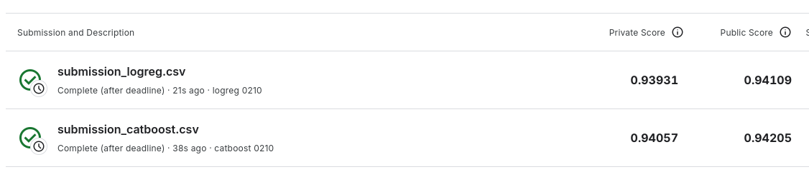

# Mental Health Prediction

Учебный проект бинарной классификации Depression. Источник - соревнование [Exploring Mental Health Data](https://www.kaggle.com/competitions/playground-series-s4e11). Основная метрика - Accuracy. Также считаем Precision, Recall, F1, ROC-AUC и Average Precision.

В 1_eda.ipynb находятся исследование и обоснование подготовки данных. В 2_models.ipynb - сравнение четырех моделей, GridSearch для LogReg и CatBoost, анализ ошибок и результаты Kaggle.

## Окружение

Нужен Python 3.12. Команды создания окружения выполняются из родительской директории data_science:

```bash
python3.12 -m venv .venv
cd data_science_project
../.venv/bin/python -m pip install --no-compile -r requirements.txt
../.venv/bin/python -m pip check
```

Если .venv уже существует, используйте ее. requirements.txt содержит полный снимок установленных пакетов, включая зависимости MLflow, DVC, pytest и Ruff. Обновлять его после изменения окружения:

```bash
../.venv/bin/python -m pip freeze > requirements.txt
```

Все дальнейшие команды выполняются из data_science_project.

## Данные

Скачайте train.csv и test.csv со [страницы данных Kaggle](https://www.kaggle.com/competitions/playground-series-s4e11/data) и положите их в data/raw.

Исходные CSV хранятся в data/raw, подготовленные train/val/test - в data/preprocessed. Подготовка и разбиение описаны в 1_eda.ipynb.

Фиксированная очистка удаляет Name, нормализует пробелы, исправляет понятные варианты Degree и проверяет значения сна и питания. Содержательные интервалы сна сохраняются. Общие индикаторы наличия учебных и рабочих данных не добавляются.

## Хранение данных в DVC

Исходные raw и подготовленные preprocessed зарегистрированы отдельными .dvc файлами. Локальный remote находится в storage/dvc. На другом компьютере локальное хранилище нужно перенести отдельно. Для VirtualBox используется cache.type=copy.

## MLflow

```bash
../.venv/bin/mlflow ui --backend-store-uri sqlite:///tracking/mlflow.db --host 127.0.0.1 --port 5000
```

Откройте [http://127.0.0.1:5000](http://127.0.0.1:5000). Ноутбук использует mental-health-models.

Ноутбук сохраняет параметры, метрики, графики и модели в локальное хранилище tracking.

## Текущие результаты

На новой подготовке данных ноутбук получил:

| Модель | CV Accuracy | Val Accuracy | Val F1 | Среднее обучение на фолде, с |
|---|---:|---:|---:|---:|
| CatBoost | 0.93904 | 0.94101 | 0.83492 | 39.1 |
| Logistic Regression | 0.93822 | 0.94108 | 0.83509 | 5.1 |
| LightGBM | 0.93775 | 0.94083 | 0.83556 | 5.7 |
| Random Forest | 0.93279 | 0.93412 | 0.81170 | 11.8 |

GridSearch выбрал исходные C=1 для LogReg и depth=6, learning_rate=0.05 для CatBoost.

После финального обучения на train + val модели показали следующие результаты на Kaggle:

| Модель | Public Score | Private Score |
|---|---:|---:|
| Logistic Regression | 0.94109 | 0.93931 |
| CatBoost | 0.94205 | 0.94057 |



CatBoost немного лучше по CV и обеим оценкам Kaggle. LogReg примерно в 7.7 раза быстрее в исходном сравнении. Для итогового варианта выбран CatBoost, LogReg остается простой и быстрой альтернативой.
